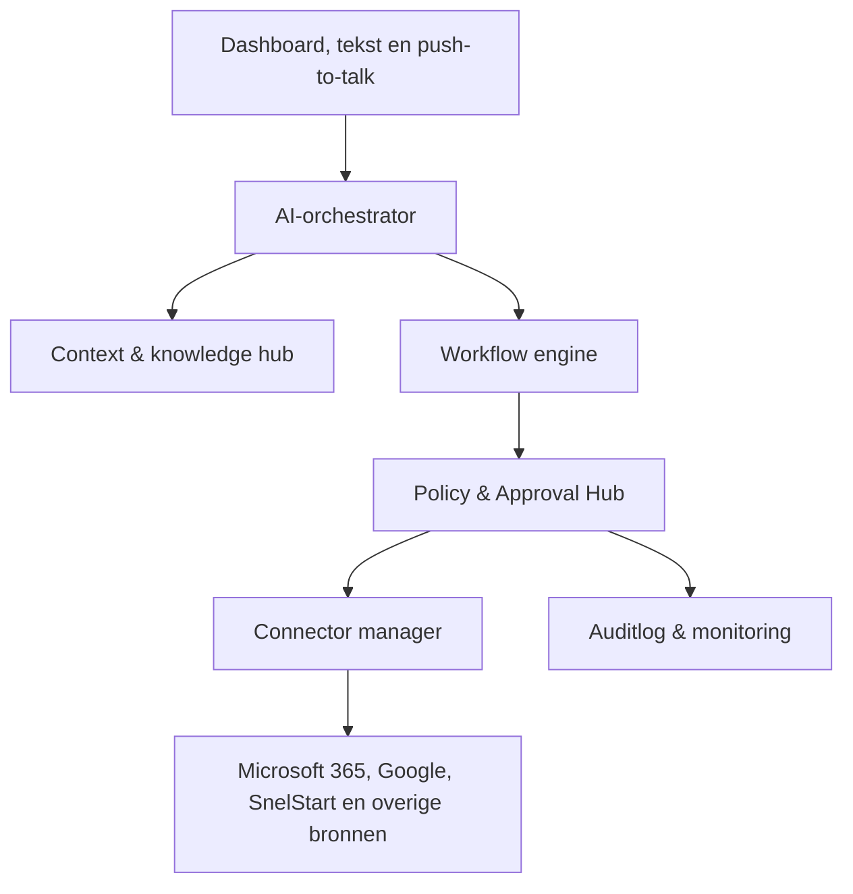

# BOB 1.0 Foundation — architectuur

## Doel

BOB is de beveiligde cockpit van Stand Up Zorg: één plek om opdrachten te geven, context uit gekoppelde systemen te lezen, controleerbare plannen te maken en acties pas na expliciete goedkeuring uit te voeren.

## Logische lagen

1. **Ervaring:** Next.js-dashboard met modules, BOB-paneel, tekstinput en later push-to-talk.
2. **Orchestratie:** intent herkennen, ontbrekende informatie signaleren, plan maken, geschikte workflow en connector kiezen.
3. **Workflow:** versieerbare stappen met input, output, foutstatus, retry en goedkeuringsmomenten.
4. **Policy:** least privilege, risiconiveau, expliciet akkoord en deny-by-default.
5. **Connectors:** één uniforme adapter per extern systeem; OAuth-tokens blijven server-side.
6. **Data:** PostgreSQL voor metadata, workflows, taken en audit. Brondata blijft zo veel mogelijk in het bronsysteem.
7. **Uitvoering:** korte API-acties op Vercel; langdurige taken via een persistente worker en event/queue-mechanisme.

## Kernobjecten

- `User`, `Organisation`, `Membership` en `Role`
- `Connection` en `ExternalAccount`
- `Task`, `TaskSource` en `TaskLink`
- `WorkflowDefinition`, `WorkflowVersion`, `WorkflowRun` en `WorkflowStepRun`
- `ApprovalRequest` en `ApprovalDecision`
- `Conversation`, `Intent`, `Plan` en `ToolCall`
- `AuditEvent`, `SecurityPolicy` en `RetentionRule`

Elke externe verwijzing bevat minimaal `provider`, `connection_id`, `external_id`, `organisation_id` en `last_synced_at`. Daarmee blijven accounts en organisaties strikt gescheiden.

## Uitvoeringsregel

Lezen en samenvatten mag binnen toegekende scopes. Versturen, wijzigen, verwijderen, plannen, publiceren, factureren en betalen is standaard geblokkeerd tot een geldige `ApprovalDecision` bestaat voor precies die actie en payload.

## Foundation-code

- `lib/foundation/modules.ts`: centrale modulecatalogus.
- `lib/foundation/policy.ts`: eerste afdwingbare goedkeuringsregel.
- `lib/foundation/orchestrator.ts`: minimaal plancontract.
- `lib/foundation/workflows.ts`: eerste workflowdefinities.
- `app/api/foundation/route.ts`: machineleesbare Foundation-status.

Dit is bewust een veilig fundament. Productiedata, echte SnelStart-mutaties en autonome impactacties zijn nog niet geactiveerd.
