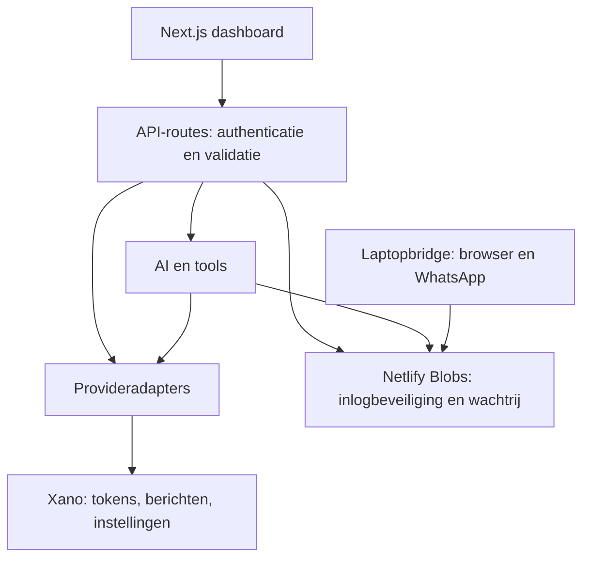

# Architectuur

## Huidige implementatie

- app bevat routes; components bevat gedeelde interface.
- lib bevat domeinlogica, authenticatie, provideradapters en opslagtoegang.
- lib/foundation bevat moduledefinities en plannen, zonder uitvoerende workflowengine.
- bridge is een apart laptopproces met eigen afhankelijkheden.
- tests bevat regressietests; scripts bevat beheertaken.

De app is een modulair monoliet voor persoonlijk gebruik. De gebruikerssleutel
is een e-mailadres. Dit is geen volwaardig organisatiemodel of tenantisolatie.

## Opslag en uitvoering

Xano wordt via de Metadata API gebruikt. Updates nemen de bestaande rij mee:
PUT vervangt een record. Verzoeken hebben een tijdslimiet; transacties en
concurrente upserts zijn daarmee nog niet opgelost.

Blobs is duurzame opslag met strong consistency. Eenmalige inloglinks gebruiken
onlyIfNew. Wachtrijclaims en beslissingen gebruiken een ETag-vergelijking;
twee gelijktijdige updates kunnen elkaar zo niet stil overschrijven. Een
opslagstoring is een fout, geen toestemming of succesvolle mutatie.

De queue claimt maximaal eenmaal. Na een crash tijdens een browseractie is de
uitkomst mogelijk onzeker; voer zo'n actie niet automatisch opnieuw uit.
Een toekomstige worker vereist idempotency en expliciete herstelstatussen.

## Beveiligingsgrenzen

Middleware controleert sessies; routes controleren ook de toegangslijst.
Bridge-tokens zijn gehasht opgeslagen en vereisen een nog toegestane gebruiker.
Weblezers controleren openbare IP-adressen, redirects en responsomvang; DNS
wordt voor de verbinding vastgezet. De laptopbrowser heeft een afzonderlijk
netwerk- en interactiebeleid dat bij live acceptatie moet worden beoordeeld.

## Hosting

Netlify kan Blobs automatisch beschikbaar maken. Buiten Netlify zijn
NETLIFY_SITE_ID en NETLIFY_AUTH_TOKEN op de server vereist. Zonder die opslag
werken inlogbeveiliging en bridge niet. Zie DEPLOYMENT.md.

## Doelarchitectuur

PostgreSQL, organisaties/rollen, auditlog, persistente workers en visuele
workflowversies zijn roadmaponderdelen. Ze zijn geen bestaande runtime-
afhankelijkheden en vereisen een afzonderlijke migratie met acceptatietests.
